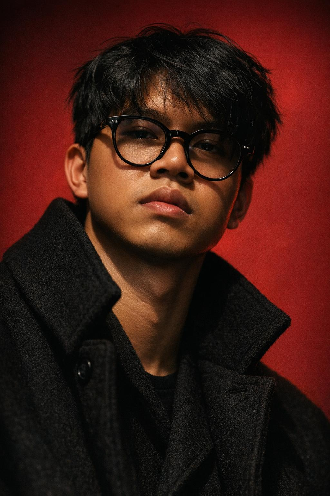

<h1 align="left">Hi 👋, I'm Rikza Fauzan</h1>

<p align="left">Frontend developer sejak 2023 yang fokus pada ekosistem <strong>TypeScript</strong> dan <strong>Next.js</strong>. Saya membangun aplikasi web modern dengan pengalaman pengguna yang kuat, performa optimal, dan desain yang bersih.</p>

<p align="left">Saya aktif di komunitas GitHub, berkontribusi pada proyek open source, berdiskusi dengan developer lain, dan terus meningkatkan keahlian melalui kolaborasi.</p>

<div align="left">
  <a href="https://www.instagram.com/rikzafauzan123/" target="_blank">
    
  </a>
  <a href="mailto:rikzafauzandev@gmail.com" target="_blank">
    
  </a>
  <a href="https://www.linkedin.com/in/rikza-fauzan-nurfadilah/" target="_blank">
    
  </a>
  <a href="https://github.com/rikzafauzannf" target="_blank">
    
  </a>
</div>

<br clear="both" />



## Experience

- **Frontend Developer** sejak 2023
- Berpengalaman membangun aplikasi web dengan **Next.js**, **React**, dan **TypeScript**
- Fokus pada arsitektur aplikasi, performa, dan pengalaman pengguna
- Aktif mengembangkan proyek open source dan berkolaborasi di GitHub

## What I Do

- Membangun website dan dashboard interaktif dengan **Next.js**
- Merancang UI/UX yang responsif dan mobile-first
- Mengoptimalkan kecepatan halaman dan aksesibilitas
- Integrasi API, autentikasi, serta deployment ke platform modern

## Project Highlights

- **Landing Page Modern**: desain bersih, animasi halus, dan konversi CTA yang jelas
- **Dashboard Analitik**: data real-time, chart interaktif, dan UX pengambilan keputusan
- **Portfolio Personal**: website profil yang kuat dengan showcase proyek dan kontak langsung

## Skills

<div align="left">
  
  
  
  
  
  
  
  
  
  
  
  
  
  
  
  
  
</div>

## AI Tools & Prompt Engineering

- **AI Tools**: GitHub Copilot, ChatGPT, OpenAI, dan tool AI lain untuk riset, desain, dan proses development.
- **Skill**: membuat prompt yang tepat agar hasil AI lebih cepat digunakan dalam alur kerja.

**Contoh prompt**:

```text
Buat halaman landing page untuk aplikasi SaaS dengan Next.js dan Tailwind CSS, fokus pada fitur utama, testimonial, dan tombol CTA yang mencolok.
```

## Community & GitHub

Saya berkontribusi di GitHub dengan:

- Membuka issue dan pull request untuk proyek open source
- Berbagi resep kode dan komponen reusable
- Mengikuti komunitas developer untuk belajar praktik terbaik

<div align="left">
  
  
</div>

<br clear="both" />

<picture>
  <source media="(prefers-color-scheme: dark)" srcset="https://raw.githubusercontent.com/rikzafauzannf/rikzafauzannf/output/pacman-contribution-graph-dark.svg">
  <source media="(prefers-color-scheme: light)" srcset="https://raw.githubusercontent.com/rikzafauzannf/rikzafauzannf/output/pacman-contribution-graph.svg">
  
</picture>

## Contact

- Email: <a href="mailto:rikzafauzandev@gmail.com">rikzafauzandev@gmail.com</a>
- Instagram: <a href="https://www.instagram.com/rikzafauzan123/">@rikzafauzan123</a>
- LinkedIn: <a href="https://www.linkedin.com/in/rikza-fauzan-nurfadilah/">linkedin.com/in/rikza-fauzan-nurfadilah</a>
- GitHub: <a href="https://github.com/rikzafauzannf">github.com/rikzafauzannf</a>
